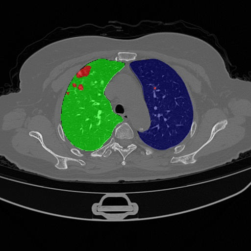
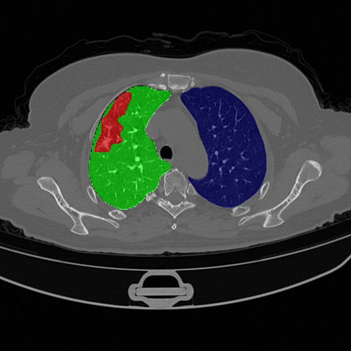
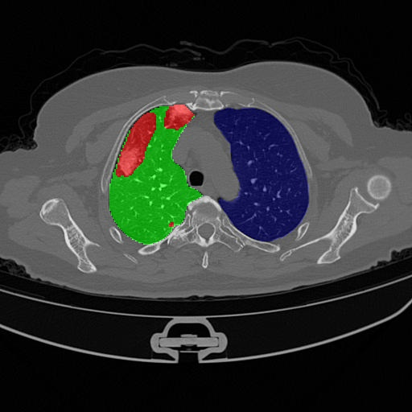
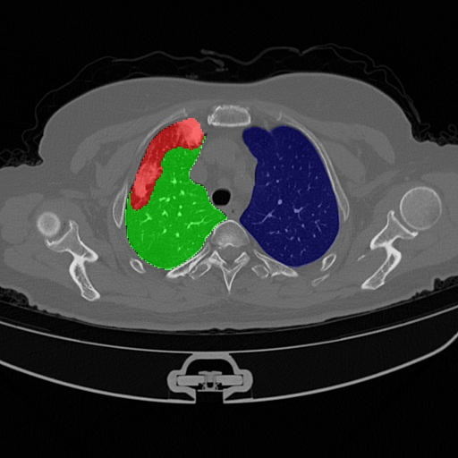

<h1>DACov: A deeper analysis of Data Augmentation on the Computed Tomography Segmentation Problem</h1>

<div style="display:flex;">
    
    
    
    
</div>

<h2>See the implementation and the available networks in: <a href="https://github.com/qubvel/segmentation_models.pytorch" target="_blank">Segmentation Models</a></h2>

<h2>Installation:</h2>

<p>pip install -r requirements.txt</p>

<p>Copy the files inside the scripts to the utils folders inside the lib/python3.6/site-packages/segmentation_models_pytorch folder</p>

<h2>Dataset:</h2>

<p>Setup a txt file with the images paths as follows for training and validation:</p>

<p>path/to/image1.jpg path/to/mask1.png <br>
path/to/image2.jpg path/to/mask2.png <br>
path/to/image3.jpg path/to/mask3.png</p>

<p>or just the images paths for tests</p>
<p>path/to/image1.jpg<br>
path/to/image2.jpg<br>
path/to/image3.jpg</p>

<p>Setup the config file following the examples in the config folder</p>

<h2>Execute:</h2>
<p>python main.py --configs config_file.yml</p>

<h2>Images Generation:</h2>

<a href="https://github.com/NVlabs/stylegan2-ada-pytorch">StyleGAN ADA Pytorch</a><br>
<a href="https://github.com/clovaai/stargan-v2">StarGANv2</a>

<p>Setup a images as following:</p>
<p>images/images/*.jpg (images from the dataset)</p>
<p>masks/lesion_masks/*.png (masks with lesions from the dataset)</p>
<p>lungs/lung_masks/*.png (predicted lung masks)</p>
<p>gan/images/*.jpg (images generated by the GAN</p>
<p>gan/predicted_masks/*.png (predicted lung masks)</p>

<h2>Execute:</h2>
<p>python augmentation.py gan</p>

<h2>Citation</h2>

```
@article{dacov2023,
author = {Bruno A. Krinski and Daniel V. Ruiz and Rayson Laroca and Eduardo Todt},
title = {DACov: a deeper analysis of data augmentation on the computed tomography segmentation problem},
journal = {Computer Methods in Biomechanics and Biomedical Engineering: Imaging \& Visualization},
volume = {0},
number = {0},
pages = {1-18},
year  = {2023},
publisher = {Taylor & Francis},
doi = {10.1080/21681163.2023.2183807},
URL = {https://doi.org/10.1080/21681163.2023.2183807},
}
```
